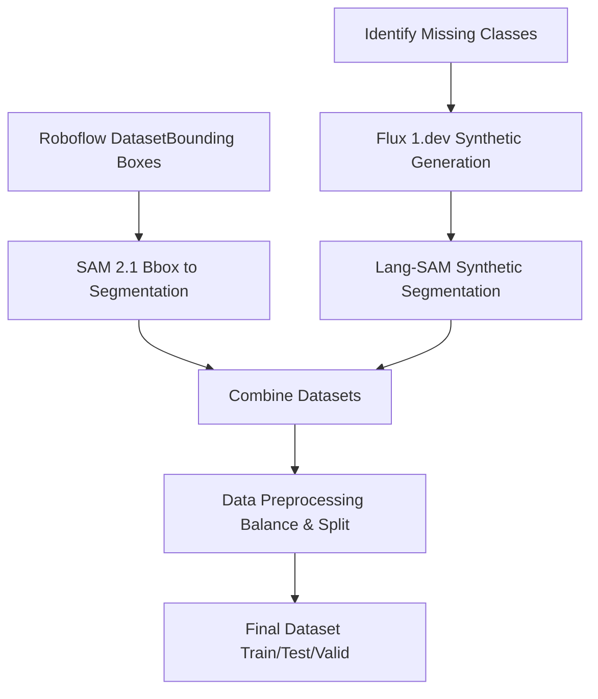

# EcoVision

```mermaid
graph TD;
    A[Roboflow DatasetBounding Boxes] --> B[SAM 2.1 Bbox to Segmentation];
    C[Identify Missing Classes] --> D[Flux 1.dev Synthetic Generation];
    D --> E[Lang-SAM Synthetic Segmentation];
    B --> F[Combine Datasets];
    E --> F;
    F --> G[Data Preprocessing Balance & Split];
    G --> H[Final Dataset Train/Test/Valid];
```
