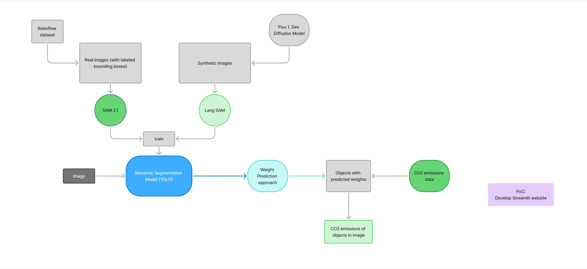

# 🌱 EcoVision AI

**AI-Powered Food Recognition & Carbon Footprint Calculator**

EcoVision AI is an advanced computer vision application that uses YOLO models to detect food items in images and calculate their carbon footprint. The application supports both bounding box detection and segmentation modes, with sophisticated weight estimation for accurate CO₂ emissions calculation.

   

## 🎯 Features

### 🔍 **Dual Detection Modes**
- **Bounding Box Detection**: Fast food recognition using average weight database
- **Segmentation Mode**: Advanced pixel-level detection with AI-powered weight estimation

### 📊 **Advanced Weight Estimation**
- **Standard Mode**: Uses pre-calculated average weights from comprehensive food database
- **Segmentation Mode**: Implements depth estimation + area calculation + density-based volume estimation for precise weight calculation

### 🎥 **Multiple Input Methods**
- **Image Upload**: Analyze food images from your device
- **Live Detection**: Real-time food detection using WebRTC for detailed analysis

### 🌍 **Carbon Footprint Analysis**
- Calculate CO₂ emissions for 45+ food categories
- Comprehensive emissions database with per-kg CO₂ factors
- Export results to CSV or Excel with detection mode indicators

### ☁️ **Cloud Deployment Ready**
- WebRTC-based camera access (no server-side camera required)
- Compatible with Streamlit Community Cloud, Heroku, AWS, GCP, Azure
- Optimized for production deployment

## 🚀 Quick Start

### Prerequisites

- Python 3.8+
- CUDA-compatible GPU (optional, for faster inference)

### Installation

1. **Clone the repository**
```
git clone https://github.com/kuennethgroup/EcoVision.git
cd EcoVision
```

2. **Install dependencies**
```
pip install -r requirements.txt
```

3. **Run the application**
```
streamlit run app.py
```

4. **Access the app**
Open your browser and navigate to `http://localhost:8501`

## 📁 Project Structure

```
EcoVision/
├── 📁 .streamlit/
│   └── config.toml              # Streamlit configuration
├── 📁 data/
│   └── data_all.xlsx           # Food CO₂ database (45+ items)
├── 📁 src/
│   ├── 📁 components/
│   │   ├── camera_controls.py   # Camera management
│   │   ├── input_live.py       # Live input handling  
│   │   └── sidebar.py          # UI sidebar components
│   ├── 📁 logic/
│   │   ├── emissions_calculator.py  # CO₂ calculations
│   │   ├── image_processing.py      # YOLO inference
│   │   ├── model_loader.py          # Model management
│   │   ├── data_loader.py           # Data loading
│   │   └── weight_estimation.py    # Advanced weight estimation
│   └── config.py               # Configuration constants
├── 📁 pages/
│   ├── image_analysis.py       # Image upload analysis
│   └── live_detection.py       # Live camera detection
├── 📁 training_pipeline/
│   ├── 📁 data_processing        # Dataset generation and processing
│   └── 📁 model_training         # Training and Evaluation of YOLO model
├── app.py                      # Main application entry
├── requirements.txt            # Python dependencies
└── README.md                   # This file

```

## 📈 Dataset and Training Pipeline

For information and code, click [here](./training_pipeline)

## Project Architecture



## 🧠 Technical Details

### Detection Modes

#### 🎯 **Bounding Box Detection**
- **Model Type**: YOLO detection models (standard .pt files)
- **Weight Estimation**: Database average weights
- **Speed**: ⚡ Fast processing
- **Use Case**: Quick analysis, real-time detection

#### 🔬 **Segmentation Mode**
- **Model Type**: YOLO segmentation models (-seg.pt files)
- **Weight Estimation**: Advanced AI-powered calculation
  - **Depth Estimation**: Depth-Anything-V2-Small-hf model
  - **Area Calculation**: Pixel-level segmentation area
  - **Volume Calculation**: Area × estimated thickness
  - **Weight Calculation**: Volume × food density
- **Speed**: 🐌 Slower but more accurate
- **Use Case**: Precise analysis, research applications

### AI Models

- **Object Detection**: Ultralytics YOLO models from Hugging Face Hub
- **Depth Estimation**: Depth-Anything-V2-Small-hf (Hugging Face Transformers)
- **Segmentation**: Custom trained YOLO segmentation models

### Data

- **Food Database**: 45 food categories with CO₂ factors, average weights, and densities
- **CO₂ Factors**: Scientific literature-based emission factors (kg CO₂ eq/kg food)
- **Densities**: Physical density values for volume-to-weight conversion

## 💡 Usage

### 1. **Select Detection Mode**
Choose between "Bounding boxes" or "Segmentation" in the sidebar

### 2. **Configure Settings**
- **Model**: Automatically filtered based on detection mode
- **Confidence**: Adjust detection threshold (0.0-1.0)
- **Class Filter**: Select specific food categories (optional)

### 3. **Analyze Food**

#### Image Analysis
1. Upload image (JPG, PNG, JPEG)
2. View detection results
3. Review CO₂ emissions report
4. Export results

#### Live Detection
1. Start camera feed
2. Capture frame when ready
3. Process with selected detection mode
4. Download results and processed image

### 4. **Export Results**
- **Formats**: CSV or Excel
- **Filenames**: Automatic mode detection (`_bb` for bounding boxes, `_seg` for segmentation)
- **Data**: Complete emissions analysis with methodology tracking

## 🛠️ Deployment

### Streamlit Community Cloud
1. Fork this repository
2. Connect to Streamlit Community Cloud
3. Deploy directly (WebRTC works out of the box)

### Other Platforms
The application is compatible with:
- **Heroku**: Add `setup.sh` and `Procfile`
- **AWS/GCP/Azure**: Use container deployment
- **Local Network**: Run with `--server.address 0.0.0.0`

### Environment Variables
```
# Optional: Hugging Face token for private models
HUGGING_FACE_TOKEN=your_token_here
```

## 📊 Supported Foods

The application recognizes 45+ food categories including:

🍎 **Fruits**: Apple, Avocado, Banana, Grapes, Orange, etc.  
🥕 **Vegetables**: Carrot, Broccoli, Tomato, Cucumber, etc.  
🫛 **Legumes**: Beans, Peas, etc.  
🍄 **Others**: Mushroom, Garlic, Ginger, etc.

*Complete list available in `data/data_all.xlsx`*

## 🔧 Configuration

### Model Configuration
Models are automatically downloaded from Hugging Face Hub:
- **Repository**: `nagasaiteja999/EcoVision`
- **Detection Models**: Standard YOLO .pt files
- **Segmentation Models**: Files containing "-seg" in filename

### Theme Customization
Edit `.streamlit/config.toml` to customize the UI theme:
```
[theme]
primaryColor = "#2E86AB"
backgroundColor = '#0E1117'
secondaryBackgroundColor = "#262730"
textColor = "#FAFAFA"
font = "sans serif"
```


### Development Setup
```
# Install development dependencies
pip install -r requirements.txt

# Run with debug mode
streamlit run app.py 
```


## 🏛️ Citation

If you use EcoVision AI in your research, please cite:

```
@software{ecovision_ai_2025,
  title={EcoVision AI: AI-Powered Food Recognition and Carbon Footprint Calculator},
  author={Kolakaleti, Naga Sai Teja},
  year={2025},
  organization={Kuenneth Research Group, University of Bayreuth},
  url={https://github.com/kuennethgroup/EcoVision}
}
```

## 👥 Credits

**Created by**: Naga Sai Teja Kolakaleti  
**Organization**: Kuenneth Research Group, University of Bayreuth  
**Copyright**: © 2025 Kuenneth Research Group, University of Bayreuth. All rights reserved.

## 🔗 Related Projects

- [Ultralytics YOLO](https://github.com/ultralytics/ultralytics)
- [Streamlit WebRTC](https://github.com/whitphx/streamlit-webrtc)
- [Depth-Anything](https://github.com/LiheYoung/Depth-Anything)

---

**⭐ Star this repository if you find it useful!**

Made with ❤️ for a sustainable future 🌍


