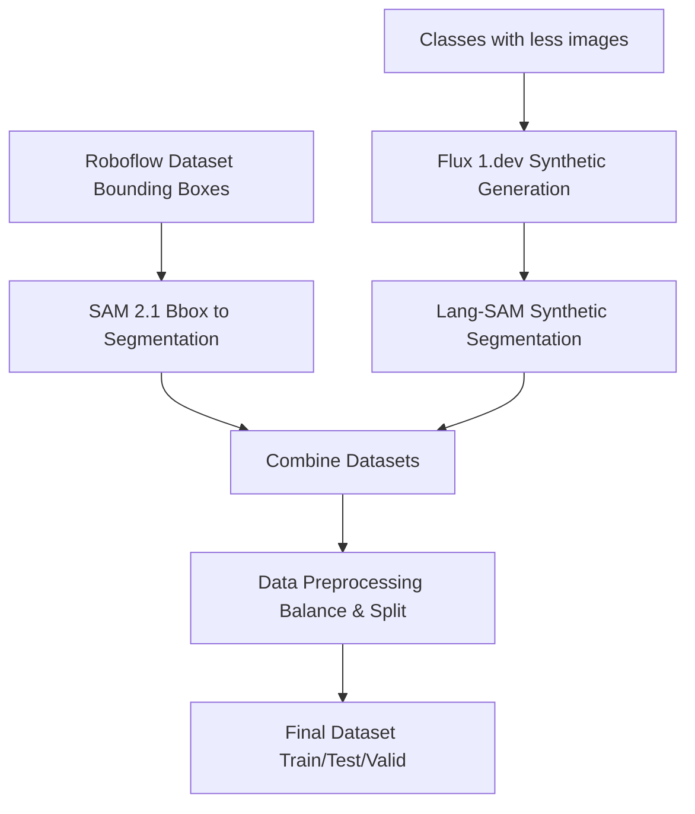

# Step 1: Data Processing & Dataset Creation

This step documents the complete process of creating training datasets for YOLO food recognition models.

## 📊 Process Overview

Here is the Flow Chart for the Data Processing and Generation



## 🎯 Sub-Steps

### **1.1 Roboflow to Segmentation Conversion**
- **Input**: Bounding box annotations from Roboflow
- **Tool**: SAM 2.1 (Segment Anything Model)
- **Output**: Pixel-level segmentation masks
- **Location**: `roboflow_to_segmentation/`

### **1.2 Synthetic Data Generation**
- **Purpose**: Fill gaps for classes with insufficient data
- **Tool**: Flux 1.dev for image generation + Lang-SAM for segmentation
- **Custom Prompts**: Class-specific prompts for realistic food images
- **Location**: `synthetic_data_generation/`

### **1.3 Data Preprocessing**
- **Balancing**: Limit to 500 images per class
- **Splitting**: 70% train, 20% test, 10% validation
- **Quality Control**: Remove duplicates and low-quality annotations
- **Location**: `data_preprocessing/`

## 🔧 Requirements

### Core ML libraries
```
ultralytics>=8.2.0
torch>=2.2.0
torchvision>=0.17.0
```

### Synthetic generation
```
diffusers>=0.21.0
transformers>=4.35.0
accelerate>=0.20.0
```

### Lang-SAM
```
lang-sam>=0.1.0
```

### Data processing
```
opencv-python>=4.8.0
Pillow>=10.0.0
numpy>=1.24.0
pandas>=2.0.0
```

## 🚀 Usage

### Run Complete Pipeline:
1. Convert Roboflow bboxes to segmentation
```
cd roboflow_to_segmentation/
python sam_bbox_to_segmentation.py
```

2. Generate synthetic data
```
cd ../synthetic_data_generation/
python flux_image_generation.py --gpu 0 # Select GPU
python lang_sam_segmentation.py
```

3. Preprocess and balance dataset
```
cd ../data_preprocessing/
python dataset_balancing.py
python train_test_split.py
python dataset_statistics.py
```

## 📁 Output Structure

```
final_dataset/
├── train/
│ ├── images/ # Training images
│ └── labels/ # YOLO format segmentation labels
├── test/
│ ├── images/ # Test images
│ └── labels/ # Test labels
└── valid/
├── images/ # Validation images
└── labels/ # Validation labels
```


## 🎯 Next Steps

After completing this step:
1. Verify dataset quality using `dataset_statistics.py`
2. Proceed to **Step 2: Model Training**
3. Use the final dataset for YOLO training

## 📝 Notes

- SAM 2.1 provides high-quality segmentation masks from bounding boxes
- Flux 1.dev generates realistic synthetic food images
- Lang-SAM handles text-based segmentation for synthetic images
- Final dataset is balanced and ready for YOLO training

---
**Processing Time**: ~9-15 hours for complete pipeline (depending upon the size of synthetic dataset generation) 

**Hardware Requirements**: GPU recommended for SAM and Flux models