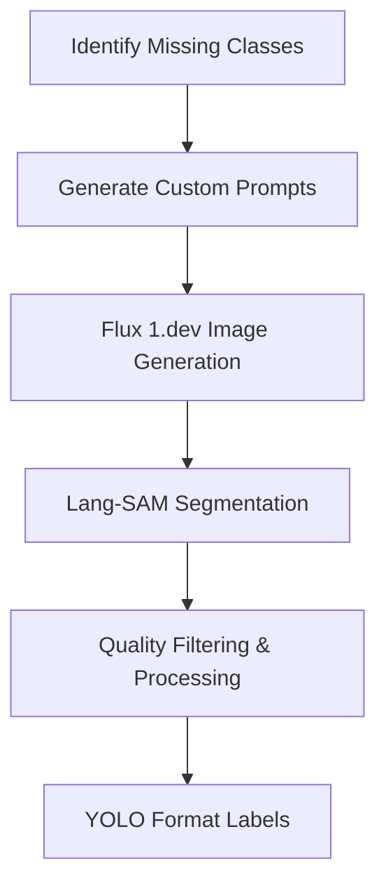

# Synthetic Data Generation

This directory contains scripts for generating synthetic food images and their segmentation masks to augment the training dataset.

## 📋 Overview

The synthetic data generation pipeline addresses data scarcity for certain food classes by:

1. **Flux 1.dev Image Generation**: Creating realistic synthetic food images
2. **Lang-SAM Segmentation**: Generating pixel-perfect segmentation masks

## 🔄 Process Flow



## 📁 Files

### **flux_image_generation.py**
- **Purpose**: Generate synthetic food images using Flux 1.dev
- **Model**: `black-forest-labs/FLUX.1-dev`
- **Features**: 
  - Custom prompts per food class
  - GPU selection for distributed processing
  - Realistic food positioning and lighting

### **lang_sam_segmentation.py**
- **Purpose**: Generate segmentation masks for synthetic images
- **Model**: Lang-SAM with SAM 2.1 Hiera Large
- **Features**: 
  - Language-guided segmentation
  - Hierarchy filtering for complex objects
  - Deduplication and overlap handling

## ⚙️ Configuration

### GPU Distribution for Flux Generation
```
gpu_class_lists = {
0: ['Blueberries', 'Garlic', 'Radish'],
1: ['Raspberries', 'Beans', 'Passion_fruits'],
2: ['Bell_peppers', 'Brussel_sprouts', 'Grapes'],
3: ['Galia_melons', 'Asparagus', 'Plums']
}
```

### Image Targets per Class
```
images_needed = {
'Asparagus': 400, 'Beans': 50, 'Bell_peppers': 150,
'Brussel_sprouts': 500, 'Galia_melons': 450,
# ... etc
}
```

## 🚀 Usage

### 1. Generate Synthetic Images

Run on different GPUs simultaneously
```
python flux_image_generation.py --gpu 0
python flux_image_generation.py --gpu 1
python flux_image_generation.py --gpu 2
python flux_image_generation.py --gpu 3
```

### 2. Generate Segmentation Masks
```
python lang_sam_segmentation.py
```

## 📊 Output Structure

```
synthetic_output/
├── images/
│ ├── Asparagus_0.jpg
│ ├── Asparagus_1.jpg
│ └── ...
└── labels/
├── Asparagus_0.txt # YOLO segmentation format
├── Asparagus_1.txt
└── ...
```

## 🎯 Quality Control Features

### **Lang-SAM Processing**
- **Deduplication**: Removes overlapping masks (IoU > 0.7)
- **Hierarchy Filtering**: Prioritizes top-level objects
- **Area Thresholding**: Removes tiny artifacts
- **Combined Mask Detection**: Filters out merged objects

### **Prompt Engineering**
- **Class-specific prompts**: Tailored for each food type
- **Positioning instructions**: "spaced apart", "random positions"
- **Quality specifications**: "photorealistic", "4K quality"
- **Background control**: "sharp and clear background"

## 🛠️ Requirements

Flux 1.dev requirements
```
diffusers>=0.21.0
transformers>=4.35.0
accelerate>=0.20.0
torch>=2.0.0
```

Lang-SAM requirements
```
lang-sam>=0.1.0
segment-anything>=1.0
ultralytics>=8.0.0
```

Image processing
```
opencv-python>=4.8.0
Pillow>=10.0.0
numpy>=1.24.0
```


## 🔑 Authentication

### Hugging Face Token
Required for Flux 1.dev access
```
login(token="your_huggingface_token_here")
```

## 📈 Performance Metrics

| Metric | Value |
|--------|-------|
| Generation Speed | ~30 seconds/image (RTX 4090) |
| Segmentation Speed | ~5 seconds/image |
| Memory Usage | ~12GB VRAM |
| Success Rate | >95% valid masks |

## 🎨 Sample Prompts

### Asparagus
```
"A natural photograph of three Asparagus spears placed at a noticeable distance
from each other in random positions, sharp and clear background, natural
lighting, unique and varied background setting, high resolution, photorealistic
detail, 4K quality"
```

### Bell Peppers
```
"A natural photograph of exactly two bell peppers, only these in sharp focus
with no other objects present, placed at a noticeable distance from each other
in random positions, sharp and clear background, natural lighting, unique and
varied background setting, high resolution, photorealistic detail, 4K quality"
```

## ⚠️ Known Issues

1. **GPU Memory**: Flux 1.dev requires significant VRAM
2. **Processing Time**: Large batch processing can take hours
3. **Quality Variation**: Some generated images may need manual review

## 🔧 Optimization Tips

- Use `enable_model_cpu_offload()` for memory efficiency
- Process in batches to avoid memory leaks
- Adjust `num_inference_steps` for speed vs quality trade-off
- Use mixed precision (`torch.bfloat16`) for faster generation

---

**Processing Time**: ~9-12 hours for complete synthetic dataset (depends upon no. of images generated)  
**Hardware**: atleast one GPU of 12GB VRAM is recommended but more GPUs can be used for optimal performance