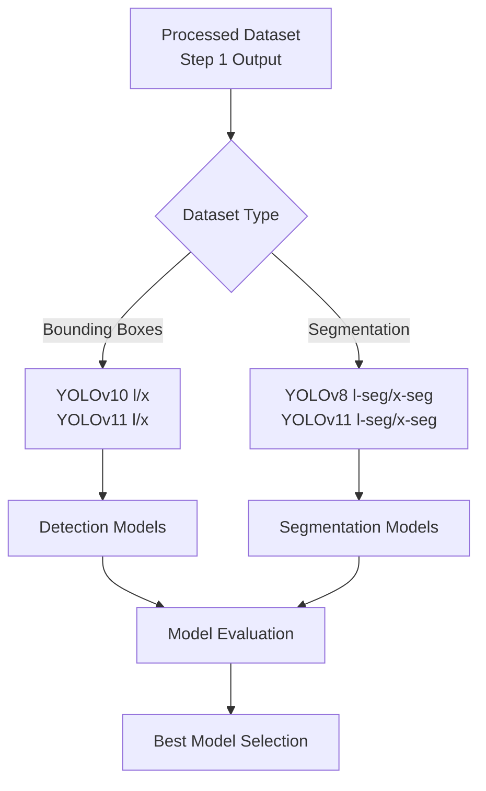

# Step 2: Model Training & Evaluation

This step documents the complete process of training YOLO models for both detection and segmentation tasks using the processed datasets from Step 1.

## 📊 Training Overview




## 🎯 Training Strategy

### **Detection Models (Bounding Boxes)**
- **YOLOv10**: State-of-the-art end-to-end detection (NeurIPS 2024)
  - YOLOv10-L: Large variant for high accuracy
  - YOLOv10-X: Extra-large variant for maximum performance
- **YOLOv11**: Latest Ultralytics release with improved efficiency
  - YOLOv11-L: Large variant with enhanced architecture
  - YOLOv11-X: Extra-large variant with superior performance

### **Segmentation Models**
- **YOLOv8-seg**: Proven segmentation performance
  - YOLOv8L-seg: Large segmentation variant
  - YOLOv8X-seg: Extra-large segmentation variant
- **YOLOv11-seg**: Latest segmentation capabilities
  - YOLOv11L-seg: Large segmentation variant
  - YOLOv11X-seg: Extra-large segmentation variant

## 📈 Dataset Information

**Classes**: 45 food categories
**Dataset Structure**:
```
data/
├── train/
│ ├── images/ # Training images
│ └── labels/ # YOLO format labels
├── test/
│ ├── images/ # Test images
│ └── labels/ # Test labels
└── valid/
├── images/ # Validation images
└── labels/ # Validation labels
```

## 🔧 Training Configuration

### **Hardware Requirements**
- **GPU**: NVIDIA RTX 4090 / A100 (16GB+ VRAM)
- **RAM**: 32GB+ recommended
- **Storage**: 100GB+ free space

### **Training Parameters**
- **Epochs**: 300 (with early stopping)
- **Batch Size**: 16
- **Image Size**: 640×640
- **Optimizer**: AdamW
- **Learning Rate**: 0.001 (with cosine decay)
- **Patience**: 50 epochs

## 🚀 Sub-Steps

### **2.1 Detection Model Training**
- **Purpose**: Train YOLO models for bounding box detection
- **Models**: YOLOv10-L/X, YOLOv11-L/X
- **Output**: Detection models with average weights approach
- **Location**: `bounding_box_training/`

### **2.2 Segmentation Model Training**
- **Purpose**: Train YOLO models for pixel-level segmentation
- **Models**: YOLOv8-L/X-seg, YOLOv11-L/X-seg
- **Output**: Segmentation models for depth-based weight estimation
- **Location**: `segmentation_training/`

### **2.3 Model Evaluation & Comparison**
- **Metrics**: mAP50, mAP50-95, Precision, Recall, F1-Score
- **Performance**: Inference speed, model size, training time
- **Selection**: Best performing models for deployment
- **Location**: `evaluation/`

## 📊 Expected Performance Targets

| Model Type | mAP50 Target | mAP50-95 Target | Inference Speed |
|------------|-------------|-----------------|-----------------|
| Detection | >0.85 | >0.60 | >30 FPS |
| Segmentation | >0.80 | >0.55 | >25 FPS |

## 🔗 External Resources

- **YOLOv10**: [THU-MIG/yolov10](https://github.com/THU-MIG/yolov10)
- **YOLOv11**: [Ultralytics YOLOv11](https://docs.ultralytics.com/models/yolo11/)
- **YOLOv8**: [Ultralytics YOLOv8](https://docs.ultralytics.com/models/yolov8/)
- **Ultralytics**: [Documentation](https://docs.ultralytics.com/)

## 🚀 Quick Start

### Run Complete Training Pipeline:
1. Train detection models
```
cd bounding_box_training/
python yolo_bb_training.py
```

2. Train segmentation models
```
cd ../segmentation_training/
python yolo_seg_training.py
```

3. Evaluate and compare models
```
cd ../evaluation/
python model_evaluation.py
python metrics_comparison.py
```

## 📁 Output Structure
```
training_outputs/
├── detection_models/
│ ├── yolov10l/
│ ├── yolov10x/
│ ├── yolov11l/
│ └── yolov11x/
├── segmentation_models/
│ ├── yolov8l-seg/
│ ├── yolov8x-seg/
│ ├── yolov11l-seg/
│ └── yolov11x-seg/
├── metrics/
│ ├── detection_metrics.csv
│ ├── segmentation_metrics.csv
│ └── comparison_report.json
└── logs/
├── training_logs/
└── evaluation_logs/
```


## 🎯 Next Steps

After completing this step:
1. Select best performing models for each task
2. Export models for deployment (ONNX, TensorRT)
3. Integrate selected models into EcoVision AI application
4. Conduct final validation on real-world data

## 📝 Notes

- YOLOv10 provides end-to-end detection without NMS post-processing
- YOLOv11 offers improved efficiency and accuracy over previous versions
- Segmentation models enable advanced weight estimation using depth analysis
- All models trained with identical hyperparameters for fair comparison

---
**Training Time**: ~1-2 weeks for complete pipeline  
**Hardware Requirements**: High-end GPU with 16GB+ VRAM recommended